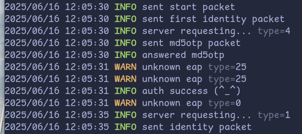

# d3x

802.1x client with ease. 😎



## Build
You'll need required tools to build it:
```shell
# Ubuntu/Debian
sudo apt update
sudo apt install cmake gcc libpcap-dev
# Fedora/RHEL
sudo dnf install cmake gcc libpcap-devel
```
In project directory:
```shell
mkdir build
cd build
cmake ..
make
```

## Todo
- [x] Kickoff Recovery  
- [x] Support for Windows  
- [ ] Integrity Check Algorithm  
- [ ] Customizability  
- [ ] Better Documentation  

## Credit

Inspired by:
- [bitdust/njit8021xclient](https://github.com/bitdust/njit8021xclient)
- [diredocks/nyn](https://github.com/diredocks/nyn)

Third Party Code used in this project:
- [cktan/tomlc99](https://github.com/cktan/tomlc99)
- [Zunawe/md5-c](https://github.com/Zunawe/md5-c)
- [kokke/tiny-AES-c](https://github.com/kokke/tiny-AES-c)
- [Base64 Encode and Decode in C](https://nachtimwald.com/2017/11/18/base64-encode-and-decode-in-c/)

> Crafted with love and a touch of C wizardry. 🪄❤️
