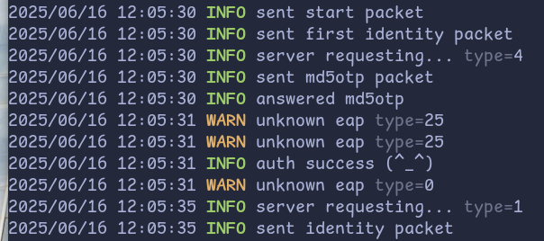

# zzz

sleepy 802.1x client. 😴



## Build
You'll need required tools to build it:
```shell
# Ubuntu/Debian
sudo apt update
sudo apt install meson pkg-config gcc libpcap-dev
# Fedora/RHEL
sudo dnf install meson pkg-config gcc libpcap-devel
```
In project directory:
```shell
meson setup build
meson compile -C build
```

## Todo
- [x] Integrity Check Algorithm  
- [ ] Kickoff Recovery  
- [ ] Support for Windows  
- [ ] Better Documentation  

## Credit

Inspired by:
- [diredocks/nyn](https://github.com/diredocks/nyn)
- [updateing/minieap](https://github.com/updateing/minieap)
- [bitdust/njit8021xclient](https://github.com/bitdust/njit8021xclient)

Third party library used in this project:
- [benhoyt/inih](https://github.com/benhoyt/inih)
- [Zunawe/md5-c](https://github.com/Zunawe/md5-c)
- [joedf/base64.c](https://github.com/joedf/base64.c)
- [kokke/tiny-AES-c](https://github.com/kokke/tiny-AES-c)

> Crafted with love and a touch of C wizardry. 🪄❤️
